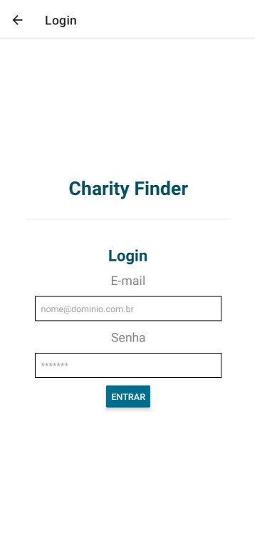
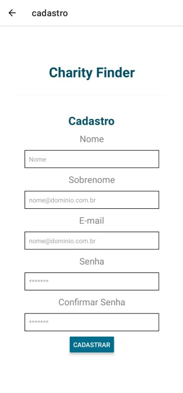
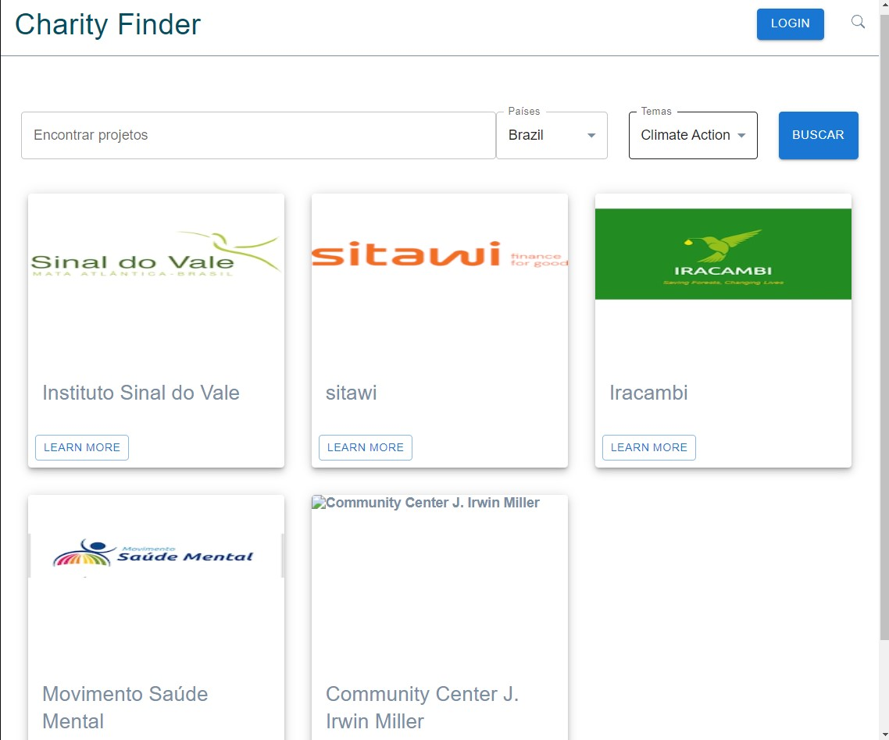
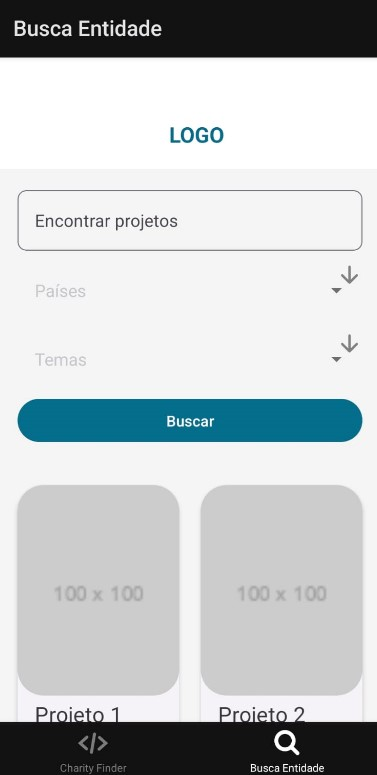

# Template Padrão da Aplicação

Layout padrão da aplicação que será utilizado em todas as páginas com a definição de identidade visual, aspectos de responsividade e iconografia.

## Página Principal

### WEB

### MOBILE

## Página de Login

### WEB

### MOBILE

## Página de Cadastro

### WEB

### MOBILE

## Página de Busca

### WEB

### MOBILE

