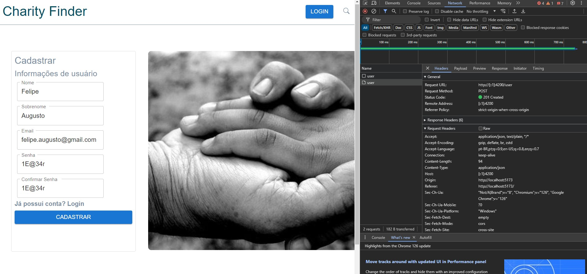
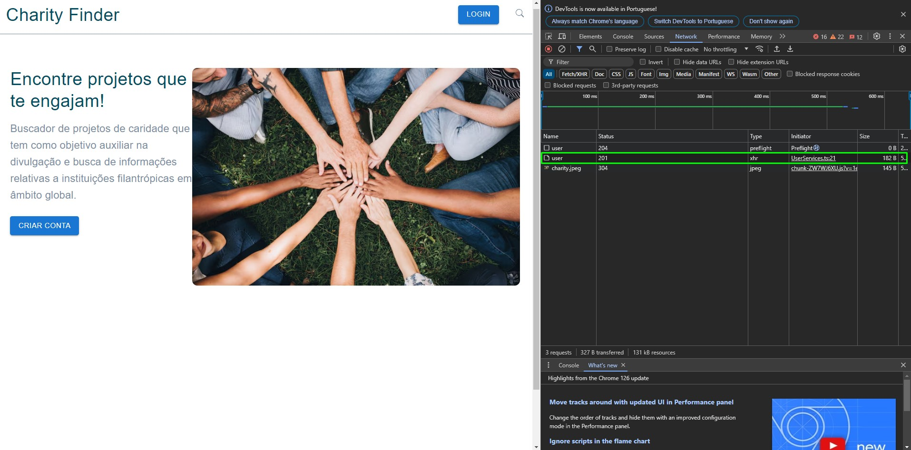
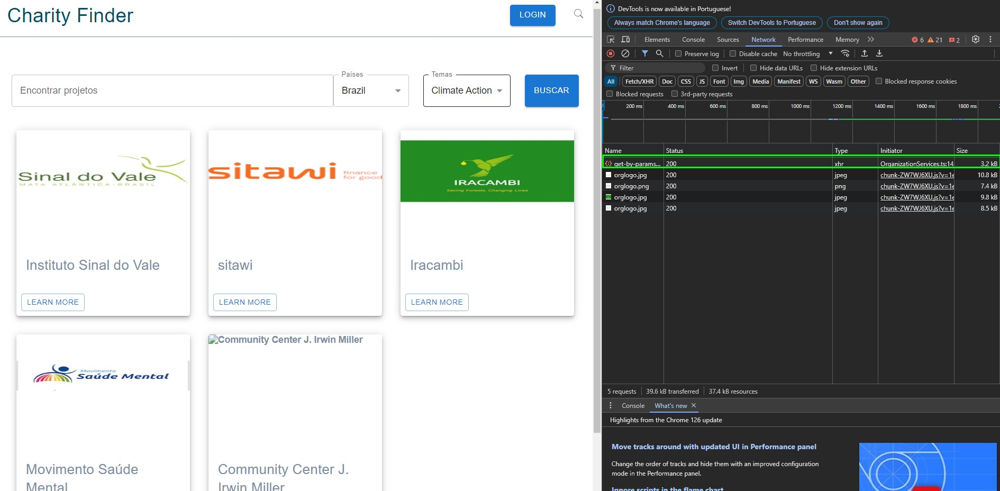

# Registro de Testes de Software

## Caso de Teste CT-01:  Registro

Requisito Associado RF – 001 - O usuário pode fazer registro no sistema.

Objetivo do Teste Verificar se o usuário consegue fazer registro na aplicação.

Registro: 
 

_________________________________________________________________________________________________________________________________________________________________________
## Caso de Teste CT-02: Fazer Login

Requisito Associado RF-001 – Os usuários podem logar no sistema.

Objetivo do Teste Verificar se os usuários podem logar em suas contas.

Registro: 
 

_________________________________________________________________________________________________________________________________________________________________________
## Caso de Teste CT-03: Buscar organizações de forma livre

Requisito Associado RF-002 – O usuário pode pesquisar por organizações/projetos sociais.

Objetivo do Teste Verificar se os usuários conseguem buscar por organizações.

Registro:
_________________________________________________________________________________________________________________________________________________________________________
## Caso de Teste CT-04: Buscar organizações através de filtros.

Requisito Associado RF-002 – O usuário pode pesquisar por organizações/projetos sociais de acordo com critérios estabelecidos (Países e Temas).

Objetivo do Teste Verificar se os usuários conseguem buscar por organizações aplicando filtro de “Países” e “Temas”.

Registro:  
 

_________________________________________________________________________________________________________________________________________________________________________
## Caso de Teste CT-05: Favoritar e exibir favoritos

Requisito Associado RF-003, RF-004 e RF-005 – Os usuários podem favoritar/desfavoritar organizações e elas serão exibidas na tela inicial do usuário.

Objetivo do Teste Verificar se os usuários conseguem favoritar e exibir organizações na tela inicial.

Registro:   

Em desenvolvimento
_________________________________________________________________________________________________________________________________________________________________________
## Caso de Teste CT-06: Deixar comentários nas páginas das organizações.

Requisito Associado RF-008 – O usuário acrescentar “comentários” na página da instituição favoritada.

Objetivo do Teste Verificar se o usuário consegue registrar comentários nas páginas das organizações.

Registro:  

Em desenvolvimento